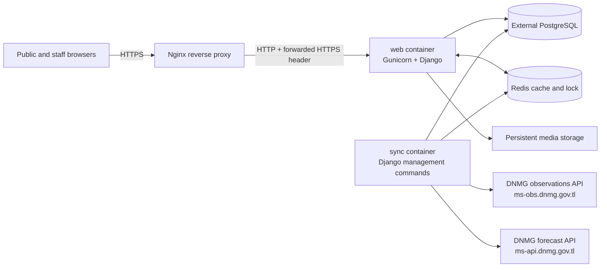
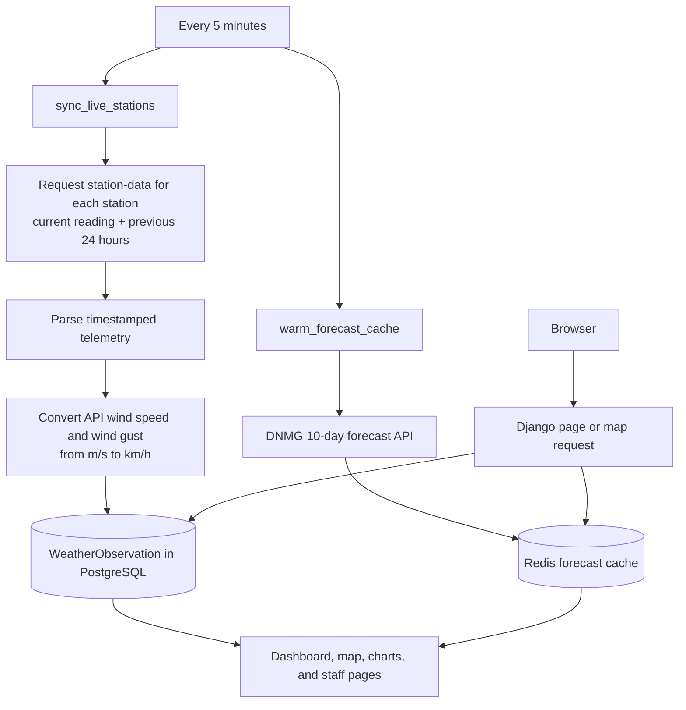

# DNMG Portal

The DNMG Portal is a Django web application for publishing public information
and supporting DNMG staff workflows, including weather observations, weather
warnings and forecasts, HR records, news, careers, bulletins, and role-based
administration.

## Documentation

- [Production deployment guide](PRODUCTION_DEPLOYMENT.md)
- [Testing and production verification](TESTING_AND_PRODUCTION_VERIFICATION.md)
- This README: local setup, architecture, and technology overview

## Architecture

The portal runs as two Django containers: `web` serves browser requests and
`sync` retrieves weather data in the background. Both share PostgreSQL, Redis,
and the persistent media directory. In production, Nginx terminates HTTPS and
proxies requests to the Django web container.



### Weather data flow

The `sync` service runs every five minutes. Public pages read already-stored
observations and cached forecasts, so visitors do not wait for external APIs.



### Main application modules

| Module | Responsibility |
| --- | --- |
| `core` | Public home page, shared pages, and site content helpers |
| `users` | Custom users, roles, permissions, sessions, and audit logging |
| `weather` | Station synchronization, observations, forecasts, warnings, maps, and weather administration |
| `hr` | Employees, departments, documents, downloads, and HR workflows |
| `cms` | News, careers, categories, and official bulletins |
| `config` | Django settings, URLs, ASGI/WSGI configuration |

## Technology stack

| Area | Technology |
| --- | --- |
| Backend | Python 3.12, Django 6, Gunicorn |
| Database | PostgreSQL with `psycopg` |
| Cache and synchronization lock | Redis 7 |
| Front end | Django templates, Bootstrap 5, HTMX, JavaScript, Leaflet maps |
| API integration | Python `urllib` and `requests` for DNMG weather and forecast APIs |
| Static files | WhiteNoise |
| Deployment | Docker, Docker Compose, Nginx, Let's Encrypt TLS |
| Background processing | Docker `sync` service running Django management commands every five minutes |
| Spreadsheet and document output | OpenPyXL, ReportLab, Pillow |

## Local development guide

Use this guide after cloning the project on a new laptop or PC. You can run
the application directly with Python or use Docker. Docker is the recommended
option because it also starts Redis and the background `sync` service.

Do not copy a production `.env` file, production database password, or
`DJANGO_SECRET_KEY` to a development computer. Each local installation should
have its own `.env` file and secret key.

### 1. Clone and configure the project

Install [Git](https://git-scm.com/) first, then clone the repository:

```bash
git clone <repository-url>
cd portal_dnmg
cp .env.example .env
```

On Windows PowerShell, use this instead of `cp`:

```powershell
Copy-Item .env.example .env
```

Generate a unique local Django secret key. With Python installed:

```bash
python -c "import secrets; print(secrets.token_urlsafe(50))"
```

Or, when using Docker and Python is not installed on the host:

```bash
docker run --rm python:3.12-slim python -c "import secrets; print(secrets.token_urlsafe(50))"
```

Paste the generated value into `.env`:

```env
DJANGO_SECRET_KEY=paste-the-generated-key-here
DJANGO_DEBUG=true
DJANGO_ALLOWED_HOSTS=localhost,127.0.0.1
DJANGO_CSRF_TRUSTED_ORIGINS=http://localhost:8000
```

The `.env` file is ignored by Git. Never commit it.

### 2. Create a local PostgreSQL database

This project deliberately uses an external PostgreSQL database; neither
`docker-compose.yml` nor `docker-compose.production.yml` creates a PostgreSQL
service. Choose one of the following approaches.

### Option A: PostgreSQL installed on the computer

Install PostgreSQL 16 or newer and create a local user and database. Run these
commands as a PostgreSQL administrator:

```sql
CREATE USER db_user WITH PASSWORD 'choose-a-strong-local-password';
CREATE DATABASE portal_db OWNER db_user;
```

Set the matching database values in `.env`:

```env
DB_NAME=portal_db
DB_USER=db_user
DB_PASSWORD=choose-a-strong-local-password
DB_HOST=127.0.0.1
DB_PORT=5432
PG_DUMP_HOST=127.0.0.1
```

### Option B: PostgreSQL in Docker

This option works for both direct Python development and Docker development.
Create a persistent Docker volume and start PostgreSQL:

```bash
docker volume create dnmg_postgres_data
docker run -d --name dnmg-postgres --restart unless-stopped -e POSTGRES_DB=portal_db -e POSTGRES_USER=db_user -e POSTGRES_PASSWORD=choose-a-strong-local-password -p 5432:5432 -v dnmg_postgres_data:/var/lib/postgresql/data postgres:16-alpine
```

For **direct Python** development, use these `.env` settings:

```env
DB_NAME=portal_db
DB_USER=db_user
DB_PASSWORD=choose-a-strong-local-password
DB_HOST=127.0.0.1
DB_PORT=5432
PG_DUMP_HOST=127.0.0.1
```

For **Django in Docker**, use `host.docker.internal` because the Django
container connects to the database through the Docker host:

```env
DB_NAME=portal_db
DB_USER=db_user
DB_PASSWORD=choose-a-strong-local-password
DB_HOST=host.docker.internal
DB_PORT=5432
PG_DUMP_HOST=127.0.0.1
```

### 3. Run directly with Python

Install Python 3.12 or newer. From the project directory, create and activate
a virtual environment:

```bash
python -m venv .venv
```

Windows PowerShell:

```powershell
.\.venv\Scripts\Activate.ps1
```

Linux/macOS:

```bash
source .venv/bin/activate
```

Install dependencies, apply migrations, and start the development server:

```bash
python -m pip install --upgrade pip
python -m pip install -r requirements.txt
python manage.py migrate
python manage.py check
python manage.py runserver
```

Open <http://127.0.0.1:8000>. To create a local administrator account:

```bash
python manage.py createsuperuser
```

Redis is optional in this mode; without `REDIS_URL`, the project uses an
in-memory development cache. The background station sync is not automatically
started outside Docker. Run it manually when needed:

```bash
python manage.py sync_live_stations
python manage.py warm_forecast_cache
```

### 4. Run with Docker

Install Docker Desktop (Windows/macOS) or Docker Engine with Docker Compose v2
(Linux). Ensure the PostgreSQL database from section 2 is running and that
`.env` uses `DB_HOST=host.docker.internal` when PostgreSQL is running on the
same computer.

Build the application, apply migrations, then start all local services:

```bash
docker compose build
docker compose run --rm web python manage.py migrate
docker compose up -d
```

Docker Compose starts these services:

- `web` — the Django site at <http://localhost:8000>
- `sync` — background station/forecast synchronization every five minutes
- `redis` — cache and synchronization support

Verify their status and follow logs:

```bash
docker compose ps
docker compose logs -f web sync
```

Create an administrator account:

```bash
docker compose exec web python manage.py createsuperuser
```

If `sync` exits immediately on a Windows checkout with an error similar to
`set: Illegal option -`, the shell script has Windows line endings. The
repository `.gitattributes` file keeps shell scripts in the required Unix LF
format; update to a revision containing that file and rebuild:

```bash
git pull
docker compose up -d --build --force-recreate sync
```

### 5. Everyday Docker commands

```bash
# Stop the portal containers. Redis data is preserved in its Docker volume.
docker compose down

# Start previously built containers again.
docker compose up -d

# Rebuild after source or requirements changes.
docker compose up -d --build

# View all services, including stopped ones.
docker compose ps -a

# Follow one service's logs.
docker compose logs -f sync
```

The separately created `dnmg-postgres` container and its
`dnmg_postgres_data` volume are persistent. Do not remove that volume unless
you intentionally want to permanently erase the local database.

### 6. Troubleshooting

| Symptom | Check |
| --- | --- |
| `web` cannot connect to PostgreSQL | Ensure `dnmg-postgres` (or local PostgreSQL) is running and the `.env` database values match. |
| Docker cannot connect to PostgreSQL on the same computer | Set `DB_HOST=host.docker.internal`, not `127.0.0.1`. |
| Browser shows a CSRF 403 after a form was left open | Refresh the page and submit again. Local sessions time out after 30 minutes of inactivity. |
| Port 8000 is already in use | Stop the other application using it, or change the left side of the `ports` mapping in `docker-compose.yml`. |
| `sync` is stopped | Run `docker compose logs sync` to see the exact failure. |
